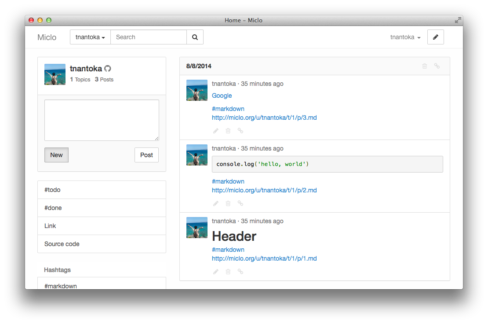

# Miclo [](https://travis-ci.org/tnantoka/miclo) [](https://coveralls.io/r/tnantoka/miclo?branch=master) [](https://codeclimate.com/github/tnantoka/miclo)

[Miclo](http://miclo.bornneet.com/) is a personal microblogging platform.



## Requirement

* Ruby 2.1
* Ruby on Rails 4.1
* GitHub API (Authorization callback path: `/auth/github/callback`)

## Installation

### Development (Mac)

```
$ git clone git@github.com:tnantoka/miclo.git
$ cd miclo/

$ bin/bundle —without production staging
$ bin/rake db:setup

# .powrc 
export GITHUB_API_KEY="your-key"
export GITHUB_API_SECRET="your-secret"

$ curl get.pow.cx | sh
$ powder link
$ open http://miclo.dev/
```

### Staging (Vagrant)

```
$ git clone git@github.com:tnantoka/miclo.git
$ cd miclo/miclo_cookbook

$ bundle exec berks vendor

$ cp ~/.ssh/id_rsa.pub site-cookbooks/miclo_cookbook/files/default/authorized_keys
$ cp ~/.ssh/id_rsa site-cookbooks/miclo_cookbook/files/default/id_rsa

# ~/.ssh/config
Host vagrant.local
  Hostname 127.0.0.1
  User ops
  Port 2222

$ export GITHUB_API_KEY="your-key"
$ export GITHUB_API_SECRET="your-secret"

$ vagrant up

$ cd ../
$ bin/bundle exec cap staging deploy
$ open http://localhost:8080/
```

### Production (exmaple.com)

```
$ git clone git@github.com:tnantoka/miclo.git
$ cd miclo/miclo_cookbook
$ bundle exec knife solo bootstrap user@example.com
$ bundle exec knife solo cook user@example.com

$ cd ../
$ bin/bundle exec cap production deploy
$ open http://example.com/
```

### Production (Heroku)

[](https://heroku.com/deploy)

[Live demo](http://miclo.herokuapp.com/)

## Contributing

Please see [CONTRIBUTING.md](https://github.com/tnantoka/miclo/blob/master/CONTRIBUTING.md).

## License

[The MIT License](https://github.com/tnantoka/miclo/blob/master/LICENCE)

## Author

[@tnantoka](https://twitter.com/tnantoka)

